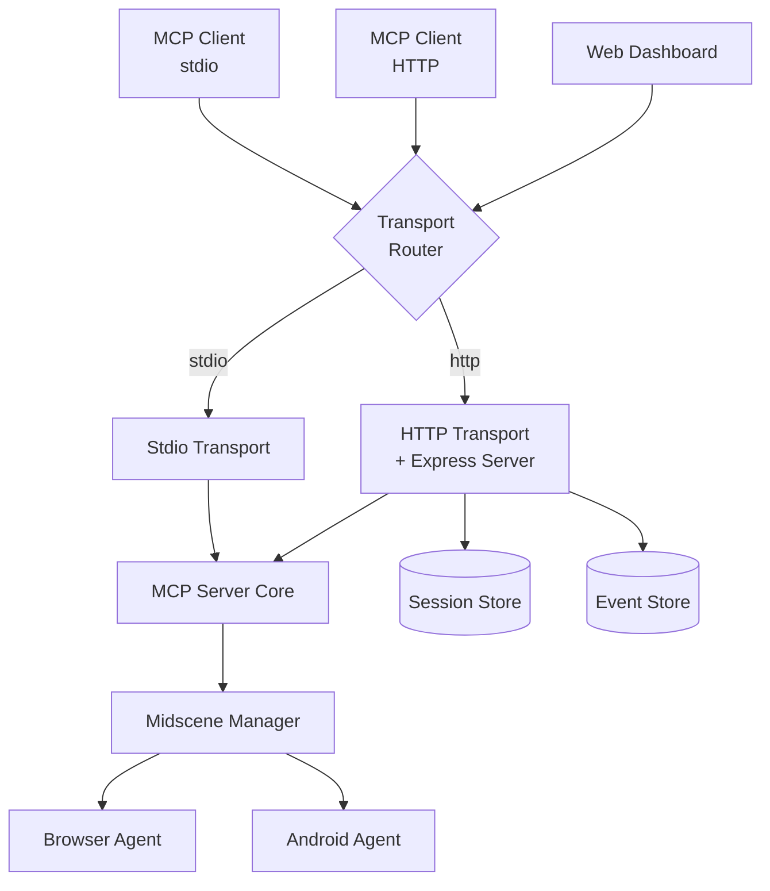

# Technical Specification: MCP HTTP Transport Support

**Version:** 1.0  
**Date:** 2025-09-22  
**Author:** AI Principal Architect

## 1. Overview & Business Goals

### 1.1 Business Context
Midscene.js is an open-source AI operator for Web, Android automation, and testing that currently supports MCP (Model Context Protocol) server functionality through stdio transport only. This limitation restricts deployment flexibility, scalability, and integration capabilities.

### 1.2 Business Goals
- **Enhanced Scalability**: Support multiple concurrent client connections
- **Cloud-Native Deployment**: Enable containerized and serverless deployments
- **Cross-Platform Compatibility**: Remove dependency on stdio for broader platform support
- **Developer Experience**: Provide HTTP-based debugging and testing capabilities
- **Integration Flexibility**: Enable web-based clients and dashboard integrations

### 1.3 Success Metrics
- Support for concurrent client connections (target: 50+ simultaneous sessions)
- Backward compatibility maintained for existing stdio clients
- HTTP transport latency < 100ms for typical operations
- Zero-downtime deployment capability
- 95% reduction in deployment complexity for cloud environments

## 2. Analysis of Existing System

### 2.1 Technology Stack
- **Runtime**: Node.js 18.19.0+ with TypeScript 5.8.3
- **Build System**: Rslib with pnpm workspace
- **MCP SDK**: @modelcontextprotocol/sdk 1.10.2
- **Core Dependencies**: 
  - Puppeteer-core 24.2.0 for browser automation
  - Sharp 0.34.3 for image processing
  - Zod 3.24.3 for schema validation

### 2.2 Current Architecture & Patterns
- **Monolithic Package Structure**: Single `@midscene/mcp` package with clear separation of concerns
- **Transport Layer**: Currently only `StdioServerTransport` is implemented
- **Agent Pattern**: `MidsceneManager` acts as a facade managing different agent types (Browser, Android)
- **Tool Registration System**: Dynamic tool registration based on runtime mode
- **Resource Management**: Centralized resource handling for screenshots and console logs

### 2.3 Key Integration Points
- **Entry Point**: `packages/mcp/src/index.ts` - Main server initialization
- **Transport Layer**: Currently hardcoded to `StdioServerTransport`
- **Manager Layer**: `MidsceneManager` class handles all business logic
- **Tool System**: Dynamic registration in `registerTools()` method
- **Configuration**: Environment variable based with `start-local-mcp.sh` script

### 2.4 Existing MCP SDK Capabilities Analysis
The project already uses `@modelcontextprotocol/sdk 1.10.2` which includes:
- `StreamableHTTPServerTransport` class with full HTTP support
- SSE (Server-Sent Events) streaming capability
- Session management and resumability features
- JSON-RPC 2.0 compliant message handling

## 3. Proposed Architecture

### 3.1 High-Level Design & Justification

**Chosen Approach: Dual Transport Architecture**

The proposed solution implements a dual transport architecture that maintains full backward compatibility while adding HTTP capabilities. This approach is superior to alternatives because:

1. **Zero Breaking Changes**: Existing stdio clients continue to work unchanged
2. **Incremental Adoption**: Teams can migrate to HTTP transport at their own pace
3. **Operational Flexibility**: Supports both local development (stdio) and production deployment (HTTP)
4. **Code Reuse**: Leverages existing MCP SDK capabilities without reinventing transport logic



### 3.2 Component Architecture

**Core Components:**

1. **Transport Router**: Determines transport mode based on configuration
2. **HTTP Transport Layer**: Wraps `StreamableHTTPServerTransport` with Express.js
3. **Session Management**: Handles concurrent client sessions
4. **Configuration Manager**: Centralized configuration handling
5. **Health & Monitoring**: HTTP-specific health checks and metrics

### 3.3 Impact Analysis

#### 3.3.1 Invasiveness Assessment
- **Minimal Core Changes**: Only `packages/mcp/src/index.ts` requires modification
- **New Files Added**: ~5 new TypeScript files for HTTP transport logic
- **Configuration Changes**: Environment variable additions, no breaking changes
- **Dependencies**: Add Express.js and CORS middleware (~2 new dependencies)

#### 3.3.2 Compatibility Matrix

| Aspect | Impact | Mitigation Strategy |
|--------|---------|-------------------|
| **Backward Compatibility** | ✅ Zero Impact | Default to stdio mode, explicit HTTP opt-in |
| **Forward Compatibility** | ✅ Extensible | Plugin architecture for future transport types |
| **API Compatibility** | ✅ Unchanged | HTTP transport exposes identical MCP tools |
| **Configuration** | ⚠️ New env vars | Additive only, no existing config changes |

#### 3.3.3 Risk Analysis & Mitigations

| Risk | Likelihood | Impact | Mitigation |
|------|------------|--------|------------|
| **Memory Leaks** | Medium | High | Implement proper session cleanup, connection timeouts |
| **Concurrent Session Issues** | Medium | Medium | Thread-safe session management, proper isolation |
| **Port Conflicts** | Low | Medium | Configurable ports, automatic port detection |
| **Security Vulnerabilities** | Medium | High | CORS configuration, rate limiting, input validation |

## 4. Detailed Design

### 4.1 API Specification

The HTTP transport will expose the same MCP tools through HTTP endpoints following the MCP Streamable HTTP specification:

#### 4.1.1 Core HTTP Endpoints

```yaml
openapi: 3.0.3
info:
  title: Midscene MCP HTTP API
  version: 1.0.0
  description: HTTP transport for Midscene MCP server

paths:
  /mcp:
    post:
      summary: Send JSON-RPC requests
      description: Primary endpoint for MCP JSON-RPC communication
      requestBody:
        required: true
        content:
          application/json:
            schema:
              oneOf:
                - $ref: '#/components/schemas/JSONRPCRequest'
                - type: array
                  items:
                    $ref: '#/components/schemas/JSONRPCRequest'
      responses:
        '200':
          description: SSE stream or JSON response
          headers:
            mcp-session-id:
              schema:
                type: string
              description: Session ID for subsequent requests
          content:
            text/event-stream:
              schema:
                type: string
            application/json:
              schema:
                $ref: '#/components/schemas/JSONRPCResponse'
    
    get:
      summary: Establish SSE connection
      description: Create persistent SSE stream for notifications
      parameters:
        - name: mcp-session-id
          in: header
          schema:
            type: string
      responses:
        '200':
          description: SSE stream established
          content:
            text/event-stream:
              schema:
                type: string

  /health:
    get:
      summary: Health check endpoint
      responses:
        '200':
          description: Service is healthy
          content:
            application/json:
              schema:
                type: object
                properties:
                  status:
                    type: string
                    example: "healthy"
                  timestamp:
                    type: string
                    format: date-time
                  version:
                    type: string
                  transport:
                    type: string
                    example: "http"

components:
  schemas:
    JSONRPCRequest:
      type: object
      required: [jsonrpc, method, id]
      properties:
        jsonrpc:
          type: string
          enum: ["2.0"]
        method:
          type: string
        params:
          type: object
        id:
          oneOf:
            - type: string
            - type: number
    
    JSONRPCResponse:
      type: object
      required: [jsonrpc, id]
      properties:
        jsonrpc:
          type: string
          enum: ["2.0"]
        result:
          type: object
        error:
          type: object
        id:
          oneOf:
            - type: string
            - type: number
```

### 4.2 Data Model

#### 4.2.1 Session Management Schema

```typescript
interface MCPSession {
  id: string;
  clientInfo: {
    userAgent?: string;
    ip: string;
    connectedAt: Date;
  };
  state: 'initializing' | 'active' | 'closing' | 'closed';
  lastActivity: Date;
  agentInstance?: MidsceneManager;
  metadata: Record<string, any>;
}

interface TransportConfig {
  mode: 'stdio' | 'http' | 'auto';
  http: {
    port: number;
    host: string;
    cors: {
      origin: string | string[];
      credentials: boolean;
    };
    session: {
      ttl: number; // milliseconds
      maxConcurrent: number;
    };
    security: {
      rateLimit: {
        windowMs: number;
        max: number;
      };
      apiKey?: string;
    };
  };
}
```

#### 4.2.2 Event Store Schema (for resumability)

```typescript
interface StoredEvent {
  id: string;
  streamId: string;
  eventData: JSONRPCMessage;
  timestamp: Date;
  sequenceNumber: number;
}
```

### 4.3 Component Breakdown

#### 4.3.1 Transport Router (`src/transport/router.ts`)

```typescript
export class TransportRouter {
  private config: TransportConfig;
  
  constructor(config: TransportConfig) {
    this.config = config;
  }
  
  async createTransport(): Promise<Transport> {
    switch (this.config.mode) {
      case 'stdio':
        return new StdioServerTransport();
      case 'http':
        return this.createHttpTransport();
      case 'auto':
        return this.detectAndCreateTransport();
      default:
        throw new Error(`Unsupported transport mode: ${this.config.mode}`);
    }
  }
  
  private async createHttpTransport(): Promise<StreamableHTTPServerTransport> {
    const sessionManager = new SessionManager(this.config.http.session);
    
    return new StreamableHTTPServerTransport({
      sessionIdGenerator: () => crypto.randomUUID(),
      enableJsonResponse: false, // Use SSE by default
      onsessioninitialized: (sessionId) => {
        sessionManager.createSession(sessionId);
      }
    });
  }
}
```

#### 4.3.2 HTTP Server Wrapper (`src/transport/http-server.ts`)

```typescript
export class MCPHttpServer {
  private app: express.Application;
  private server?: http.Server;
  private transport: StreamableHTTPServerTransport;
  private sessionManager: SessionManager;
  
  constructor(
    transport: StreamableHTTPServerTransport,
    config: TransportConfig['http']
  ) {
    this.transport = transport;
    this.app = express();
    this.sessionManager = new SessionManager(config.session);
    this.setupMiddleware(config);
    this.setupRoutes();
  }
  
  private setupMiddleware(config: TransportConfig['http']): void {
    // CORS configuration
    this.app.use(cors({
      origin: config.cors.origin,
      credentials: config.cors.credentials,
      methods: ['GET', 'POST', 'DELETE', 'OPTIONS'],
      allowedHeaders: ['Content-Type', 'Accept', 'mcp-session-id']
    }));
    
    // Rate limiting
    if (config.security.rateLimit) {
      this.app.use(rateLimit(config.security.rateLimit));
    }
    
    // Request parsing
    this.app.use(express.json({ limit: '10mb' }));
    
    // Request logging
    this.app.use(this.requestLogger);
  }
  
  private setupRoutes(): void {
    // Main MCP endpoint
    this.app.all('/mcp', this.handleMCPRequest.bind(this));
    
    // Health check
    this.app.get('/health', this.handleHealthCheck.bind(this));
    
    // Session management
    this.app.get('/sessions', this.handleListSessions.bind(this));
    this.app.delete('/sessions/:id', this.handleCloseSession.bind(this));
  }
  
  private async handleMCPRequest(req: Request, res: Response): Promise<void> {
    try {
      await this.transport.handleRequest(req, res, req.body);
    } catch (error) {
      this.handleError(error, res);
    }
  }
  
  async start(): Promise<void> {
    const port = process.env.MIDSCENE_MCP_HTTP_PORT || 3000;
    const host = process.env.MIDSCENE_MCP_HTTP_HOST || '0.0.0.0';
    
    this.server = this.app.listen(port, host, () => {
      console.log(`🚀 Midscene MCP HTTP Server listening on http://${host}:${port}`);
    });
  }
}
```

#### 4.3.3 Session Manager (`src/transport/session-manager.ts`)

```typescript
export class SessionManager {
  private sessions = new Map<string, MCPSession>();
  private config: TransportConfig['http']['session'];
  private cleanupInterval: NodeJS.Timeout;
  
  constructor(config: TransportConfig['http']['session']) {
    this.config = config;
    this.startCleanupTimer();
  }
  
  createSession(sessionId: string, clientInfo?: Partial<MCPSession['clientInfo']>): MCPSession {
    if (this.sessions.size >= this.config.maxConcurrent) {
      throw new Error('Maximum concurrent sessions reached');
    }
    
    const session: MCPSession = {
      id: sessionId,
      clientInfo: {
        ip: clientInfo?.ip || 'unknown',
        userAgent: clientInfo?.userAgent,
        connectedAt: new Date()
      },
      state: 'initializing',
      lastActivity: new Date(),
      metadata: {}
    };
    
    this.sessions.set(sessionId, session);
    return session;
  }
  
  private startCleanupTimer(): void {
    this.cleanupInterval = setInterval(() => {
      this.cleanupExpiredSessions();
    }, 60000); // Check every minute
  }
  
  private cleanupExpiredSessions(): void {
    const now = new Date();
    for (const [sessionId, session] of this.sessions.entries()) {
      if (now.getTime() - session.lastActivity.getTime() > this.config.ttl) {
        this.closeSession(sessionId);
      }
    }
  }
}
```

#### 4.3.4 Configuration Manager (`src/config/transport-config.ts`)

```typescript
export class TransportConfigManager {
  static load(): TransportConfig {
    return {
      mode: (process.env.MIDSCENE_MCP_TRANSPORT as any) || 'stdio',
      http: {
        port: parseInt(process.env.MIDSCENE_MCP_HTTP_PORT || '3000'),
        host: process.env.MIDSCENE_MCP_HTTP_HOST || '0.0.0.0',
        cors: {
          origin: process.env.MIDSCENE_MCP_CORS_ORIGIN || '*',
          credentials: process.env.MIDSCENE_MCP_CORS_CREDENTIALS === 'true'
        },
        session: {
          ttl: parseInt(process.env.MIDSCENE_MCP_SESSION_TTL || '1800000'), // 30 minutes
          maxConcurrent: parseInt(process.env.MIDSCENE_MCP_MAX_SESSIONS || '50')
        },
        security: {
          rateLimit: {
            windowMs: parseInt(process.env.MIDSCENE_MCP_RATE_WINDOW || '60000'), // 1 minute
            max: parseInt(process.env.MIDSCENE_MCP_RATE_MAX || '100')
          },
          apiKey: process.env.MIDSCENE_MCP_API_KEY
        }
      }
    };
  }
  
  static validate(config: TransportConfig): void {
    if (config.http.port < 1 || config.http.port > 65535) {
      throw new Error('Invalid HTTP port number');
    }
    
    if (config.http.session.maxConcurrent < 1) {
      throw new Error('maxConcurrent must be at least 1');
    }
    
    if (config.http.session.ttl < 60000) {
      throw new Error('Session TTL must be at least 60 seconds');
    }
  }
}
```

## 5. Non-Functional Requirements (NFRs)

### 5.1 Security

#### 5.1.1 Authentication & Authorization
- **API Key Support**: Optional API key authentication via header or query parameter
- **Session Validation**: Cryptographically secure session IDs with proper validation
- **Input Sanitization**: All JSON-RPC inputs validated against schemas

#### 5.1.2 Data Protection
- **HTTPS Support**: TLS termination at reverse proxy level (nginx/ALB)
- **CORS Configuration**: Strict origin control for browser-based clients
- **Rate Limiting**: Configurable rate limits per IP/session

#### 5.1.3 Security Headers
```typescript
const securityHeaders = {
  'X-Content-Type-Options': 'nosniff',
  'X-Frame-Options': 'DENY',
  'X-XSS-Protection': '1; mode=block',
  'Referrer-Policy': 'strict-origin-when-cross-origin'
};
```

### 5.2 Performance & Scalability

#### 5.2.1 Performance Targets
- **Request Latency**: < 100ms for tool invocations (P95)
- **Concurrent Sessions**: Support 50+ simultaneous sessions
- **Memory Usage**: < 512MB baseline + 10MB per active session
- **CPU Usage**: < 70% on 2-core instances under normal load

#### 5.2.2 Scalability Strategy
- **Horizontal Scaling**: Stateless design enables load balancer distribution
- **Session Affinity**: Optional sticky sessions for complex workflows
- **Resource Pooling**: Shared browser instances across sessions where possible

#### 5.2.3 Caching Strategy
- **Screenshot Caching**: LRU cache for recent screenshots (configurable size)
- **Session State**: In-memory session storage with optional Redis backend
- **Static Assets**: CDN-friendly health check endpoints

### 5.3 Observability

#### 5.3.1 Logging Strategy
```typescript
const logLevels = {
  ERROR: ['transport_errors', 'session_failures', 'tool_exceptions'],
  WARN: ['session_timeouts', 'rate_limit_hits', 'deprecated_usage'],
  INFO: ['session_lifecycle', 'transport_mode', 'server_startup'],
  DEBUG: ['request_details', 'session_state', 'tool_invocations']
};
```

#### 5.3.2 Metrics Collection
- **Request Metrics**: Count, duration, error rate by tool type
- **Session Metrics**: Active sessions, session duration, cleanup rate
- **Resource Metrics**: Memory usage, CPU usage, connection count
- **Business Metrics**: Tool usage patterns, client types, error categories

#### 5.3.3 Health Checks
```typescript
interface HealthStatus {
  status: 'healthy' | 'degraded' | 'unhealthy';
  checks: {
    transport: boolean;
    sessions: boolean;
    memory: boolean;
    dependencies: boolean;
  };
  metrics: {
    uptime: number;
    activeSessions: number;
    memoryUsage: NodeJS.MemoryUsage;
  };
}
```

### 5.4 Testing Strategy

#### 5.4.1 Unit Tests (Target: 90% coverage)
- **Transport Layer**: Mock HTTP requests/responses
- **Session Management**: Session lifecycle, cleanup, limits
- **Configuration**: Environment variable parsing, validation
- **Error Handling**: All error scenarios and edge cases

#### 5.4.2 Integration Tests
- **HTTP Transport**: End-to-end MCP tool invocations
- **Concurrent Sessions**: Multi-client scenarios
- **Backward Compatibility**: Stdio transport still works
- **Configuration**: Different transport modes and settings

#### 5.4.3 Load Testing
- **Concurrent Load**: 50 simultaneous sessions performing typical workflows
- **Stress Testing**: Resource exhaustion scenarios
- **Failover Testing**: Transport switching and error recovery

## 6. Implementation Plan

### 6.1 Phase 1: Foundation (Week 1-2)
**Effort: Large (L)**

**Deliverables:**
- [ ] Transport configuration system
- [ ] Basic HTTP server wrapper
- [ ] Transport router implementation
- [ ] Unit tests for core components

**Dependencies:**
- Add Express.js and related dependencies
- Update TypeScript configurations

### 6.2 Phase 2: Core HTTP Transport (Week 3-4)
**Effort: Large (L)**

**Deliverables:**
- [ ] StreamableHTTPServerTransport integration
- [ ] Session management system
- [ ] Basic security middleware
- [ ] Integration tests

**Dependencies:**
- Phase 1 completion
- MCP SDK compatibility verification

### 6.3 Phase 3: Production Readiness (Week 5-6)
**Effort: Medium (M)**

**Deliverables:**
- [ ] Comprehensive logging and monitoring
- [ ] Health check endpoints
- [ ] Error handling and recovery
- [ ] Performance optimization

**Dependencies:**
- Phase 2 completion
- Load testing infrastructure

### 6.4 Phase 4: Documentation & Deployment (Week 7)
**Effort: Small (S)**

**Deliverables:**
- [ ] API documentation
- [ ] Deployment guides
- [ ] Migration documentation
- [ ] Example client implementations

**Dependencies:**
- All previous phases completed
- Internal testing completed

### 6.5 Rollout Strategy

#### 6.5.1 Feature Flag Approach
```typescript
const FEATURE_FLAGS = {
  HTTP_TRANSPORT: process.env.MIDSCENE_ENABLE_HTTP_TRANSPORT === 'true',
  SESSION_MANAGEMENT: process.env.MIDSCENE_ENABLE_SESSIONS === 'true',
  ADVANCED_MONITORING: process.env.MIDSCENE_ENABLE_MONITORING === 'true'
};
```

#### 6.5.2 Deployment Phases
1. **Internal Testing**: Enable HTTP transport for development team
2. **Beta Release**: Opt-in HTTP transport for selected users
3. **General Availability**: HTTP transport available by default
4. **Migration Period**: Encourage migration from stdio to HTTP
5. **Stdio Deprecation**: (Future) Gradual deprecation of stdio mode

## 7. Open Questions & Future Considerations

### 7.1 Open Questions
1. **Event Store Implementation**: Should we implement persistent event storage for resumability, or start with in-memory only?
2. **Load Balancing**: Do we need built-in load balancing, or rely on external load balancers?
3. **WebSocket Support**: Should we consider WebSocket transport as an alternative to SSE?
4. **Metrics Backend**: Which metrics backend should we integrate with (Prometheus, StatsD, custom)?

### 7.2 Future Enhancements
1. **GraphQL Transport**: Explore GraphQL as an alternative to JSON-RPC
2. **gRPC Support**: High-performance binary protocol for internal services
3. **Webhook Integration**: Outbound webhook support for event notifications
4. **Multi-tenancy**: Support for tenant isolation and resource quotas
5. **Plugin Architecture**: Extensible transport plugin system

### 7.3 Migration Path
1. **Stdio Deprecation Timeline**: 6-month notice period before stdio deprecation
2. **Client SDK Updates**: Provide HTTP-compatible client SDKs
3. **Backward Compatibility**: Maintain stdio support for at least 12 months post-HTTP GA
4. **Migration Tools**: Automated tools to help users migrate configurations

---

## Appendix A: Configuration Reference

### A.1 Environment Variables

| Variable | Default | Description |
|----------|---------|-------------|
| `MIDSCENE_MCP_TRANSPORT` | `stdio` | Transport mode: `stdio`, `http`, or `auto` |
| `MIDSCENE_MCP_HTTP_PORT` | `3000` | HTTP server port |
| `MIDSCENE_MCP_HTTP_HOST` | `0.0.0.0` | HTTP server bind address |
| `MIDSCENE_MCP_CORS_ORIGIN` | `*` | CORS allowed origins |
| `MIDSCENE_MCP_SESSION_TTL` | `1800000` | Session timeout in milliseconds |
| `MIDSCENE_MCP_MAX_SESSIONS` | `50` | Maximum concurrent sessions |
| `MIDSCENE_MCP_API_KEY` | - | Optional API key for authentication |

### A.2 Example Docker Configuration

```dockerfile
FROM node:18-alpine

# Install dependencies
COPY package*.json ./
RUN npm ci --only=production

# Copy application
COPY dist/ ./dist/

# Configure HTTP transport
ENV MIDSCENE_MCP_TRANSPORT=http
ENV MIDSCENE_MCP_HTTP_PORT=3000
ENV MIDSCENE_MCP_CORS_ORIGIN=https://your-domain.com

EXPOSE 3000
CMD ["node", "dist/index.js"]
```

---

*This technical specification provides a comprehensive blueprint for implementing HTTP transport support in Midscene MCP. The design prioritizes backward compatibility, security, and operational excellence while enabling modern deployment patterns.*
